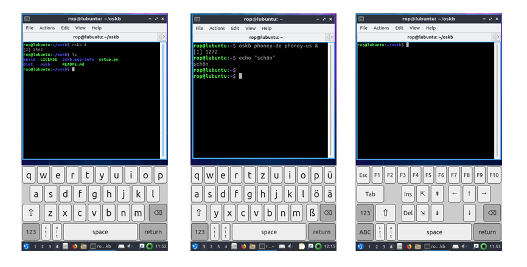

# oskb - On-Screen keyboard for Linux, written in python with qt

## Introduction

I disliked the on-screen keyboards for Linux I tried. So I wrote a new one. Good way to learn Qt and get a little bit more experience in python. It's all very preliminary, please test and file issues with comments and feature requests.

## Instructions:

* You'll need python3, there are no oskb packages for your Linux distro yet. It's all very fresh and alpha.

* `pip3 install oskb` to use the version from PyPI, or `pip3 install git+https://github.com/ropg/oskb` to get the bleeding edge from github.

* oskb does not put its keys into X11 but into the underlying Linux kernel. This means it will in future also work without X11, when talking to the framebuffer directly. What this also means is it needs to connect a virtual keyboard to your machine. The user you are logged in as is probably not allowed to do that. The easiest way to solve this if you want to test oskb is to type `sudo setfacl -m m::rw -m u:<username>:rw /dev/uinput`, replacing `<username>` with your username. This gives you permission to plug in the virtual keyboard.

* Now run `oskb` to use the keyboard and see if you like it. There is presently only a phone-like layout, which is a bit too sparse for a large portrait screen. You may want to run `oskb --width 480` to get a better feel for what the present default layout should look like. There will be pad-like keyboards and full-size keyboards available soon.

* Full documentation, screenshots, it is all coming. This is alpha software, all typed in very very recently. Try `osk --help` for some command line options that might be of help.

* It's written to be embedded. Have a look at cli.py to see how oskb gives you a QWidget that you can do with whatever you want. In the future there will be more places you send keypresses to, including X11 and your own functions.

* There will be a wysiwyg editor for new keyboards, but feel free to wrestle with the JSON files that hold the keyboard layouts until then.

* Do try `oskb phoney-us phoney-de` and then pressing and holding the '123' key... 

* The change to /dev/uinput does not stick, so lacking proper Linux packages for the various distributions, you might want to stick the `setfacl`-thing from above (without the sudo) at the end of your `/etc/rc.local` file.

* It is a bit early to use this for anything too serious. But progress is happening fast.

* Tell me what you think.